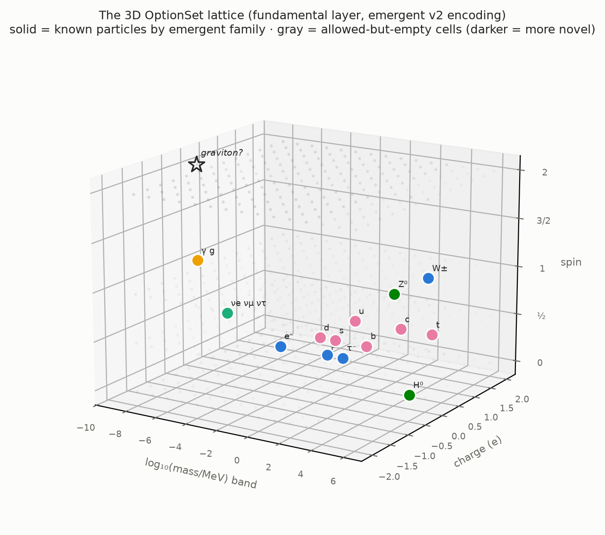
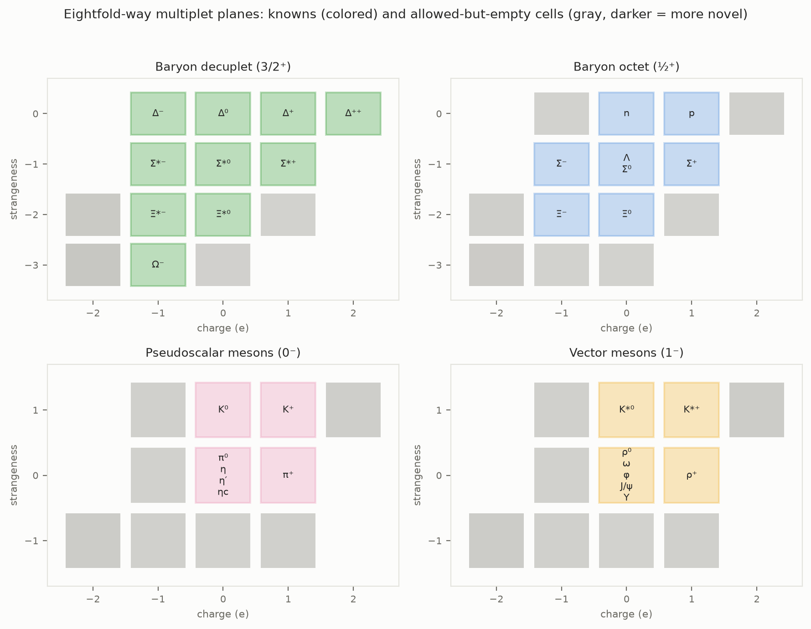
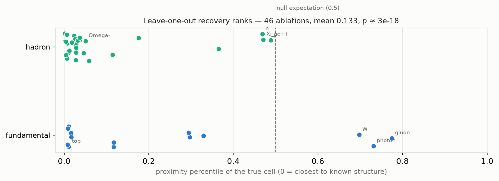
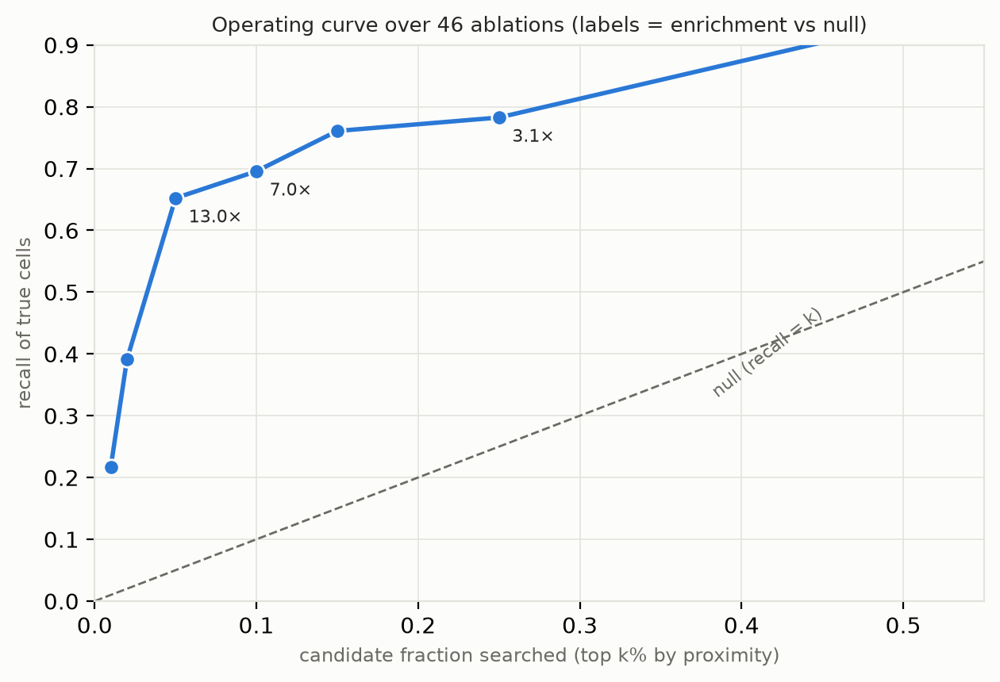

# Lattice-Gap Prediction in Particle Physics: A Reproducible Statistical Evaluation of Mendeleev-Style Inference

**Olaf Andreas Øvrum**
*Draft v1.3 (2026-07-17) — prepared with Claude (Anthropic). All numerical
results are reproducible from the accompanying repository and asserted by
its test suite (82 tests). References [6–15] verified against
publisher/arXiv listings on 2026-07-17; [1–5] are standard-form citations
of historical works.*

---

## Abstract

The most celebrated predictions in the history of particle classification —
Mendeleev's eka-elements, the Ω⁻ baryon, the τ mass via the Koide relation —
share one epistemology: arrange known entities in a discrete lattice of
measurable properties, and treat *allowed-but-unoccupied cells* as
predictions. This paper asks a question that, to our knowledge, has not been
posed quantitatively: **how much better than chance is that inference
pattern, evaluated systematically across the particle zoo?** We construct a
minimal property lattice (the "OptionSet lattice") spanning 17 fundamental
particles and 42 well-established hadrons, enumerate all
sanity-filtered property combinations, and evaluate gap-prediction by
leave-one-out ablation: each particle is removed and its true cell is ranked
among all candidate cells by proximity to the remaining structure. Across 46
evaluable ablations the true cell ranks at mean percentile 0.137 against a
uniform null of 0.5 (z = 8.5, p ≈ 7×10⁻¹⁸). A pre-registered decision rule —
"search the top 5% of candidates by proximity" — captures 63% of true cells
at 12.6× the chance rate (binomial p ≈ 10⁻²⁶). Mass prediction layered on
the lattice reproduces the Ω⁻ mass to 0.8% (Gell-Mann–Okubo) and the τ mass
to 0.008% (Koide), beating naive-mean nulls by two to four orders of
magnitude. Robustness experiments show the structural results survive ±26%
mass noise while precision mass prediction degrades to null level,
quantifying that the two inference modes have different input requirements.
The method also cleanly delimits its own failure mode: isolated particles
(photon, gluon, W) rank *worse* than chance, confirming that lattice-gap
inference predicts pattern-completions, not lone states. A sourced
historical audit of 16 contemporaneous gap-predictions bounds the method's
precision at 67–89% across two independent raters (inclusive reading:
8/12, Wilson 95%: 39–86%; strict: 8/9), with failures concentrated exactly
where the ablations predict: extrapolations *beyond* the pattern went 0/4
while completions *within* it went 8/8. Applying the resulting rule
prospectively, we register forward predictions for the unobserved
doubly-heavy baryons (Ξ_bb 10 250, Ω_bb 10 410, Ξ_bc 6 932, Ω_bc 7 092,
all ±48 MeV), validated out-of-sample against the Ω_cc⁺ observed by LHCb
in June 2026 (predicted 3 775 vs ~3 727 MeV measured). The lattice, its
gap analysis, and the predictions ship as an open harness with an
interactive 3D explorer; every number in this paper is asserted by its
test suite.

## 1. Introduction

Three of the most famous predictions in physics were made by staring at a
table with holes in it. Mendeleev (1869) ordered the elements by observable
properties and predicted gallium and germanium from the gaps [1]. Gell-Mann
and Ne'eman (1961) organized the hadrons into flavor multiplets and predicted
the Ω⁻ — including its mass, via the equal-spacing rule [4] — three years
before its discovery [2, 3, 5]. Koide (1982) found an empirical relation over
the charged leptons that pinned the τ mass to four digits while measurements
still disagreed with it [6].

Each of these is retold as an anecdote. Collectively they suggest a *method*:
discretize known entities into a lattice of conserved or measurable
quantities, filter the full combinatorial space by coarse consistency rules,
and rank the unoccupied cells. But the method's aggregate reliability has —
as far as we know — never been measured. Individual successes are memorable
precisely because they are selected; a fair evaluation must also count the
cells that were flagged and never filled, and the particles that no
gap-argument would have found.

This paper contributes such an evaluation. We make no claim of new physics:
every physical ingredient below (quantum-number bookkeeping, the
Gell-Mann–Nishijima relation, spin-statistics, GMO, Koide) is textbook
material. Our contribution is methodological and statistical:

1. a **unified minimal encoding** ("OptionSet lattice") applied identically
   to fundamental particles and hadrons;
2. **executable historical backtests** — the Higgs, top, Ω⁻ (cell and mass),
   and τ (mass) predictions run as unit tests against explicit assertions;
3. a **systematic leave-one-out evaluation** with null models, permutation
   tests, jitter robustness, and a pre-registered operating curve;
4. two findings about the method itself: **proximity, not novelty, is the
   discovery-predictive ranking**, and **isolated states are a quantified
   failure mode**;
5. **registered forward predictions** — within-pattern doubly-heavy baryon
   cells with framework-native mass estimates and falsification criteria,
   validated out-of-sample against the freshly observed Ω_cc⁺;
6. an open-source harness — including an interactive **3D OptionSet
   Lattice explorer** — in which every claim in this paper is a passing
   test.

### 1.1 Related work

Two established genres border this work, and neither answers its question.

**Systematic quantum-number enumeration.** Theory-driven catalogs of
hypothetical particles by quantum-number assignment are a mature genre:
minimal dark matter classifies electroweak multiplets by (SU(2), Y)
assignment and stability [7]; the vector-like quark handbook enumerates the
seven gauge-consistent multiplet types and their mixings [8]; simplified
dark-matter model scans do the same for mediator quantum numbers. These
works enumerate *within a chosen gauge theory* and derive dynamics
(couplings, production rates) that our coarse lattice deliberately lacks.
They do not, however, evaluate the enumeration *method's* historical hit
rate — each catalog is offered as theory, not tested as an inference
pattern.

**Machine-learning rediscovery of classification structure.** Atom2Vec
recovered the periodic table's group structure from co-occurrence data
alone [11], and, closest to our setting, Abdelhaq, Piantadosi and Quevedo
recently applied dimensionality reduction and clustering to particle
properties and decay modes, autonomously recovering baryon number,
strangeness, isospin, the eightfold-way multiplets, and Regge-trajectory
patterns [12]. That work demonstrates the *structure* of the particle zoo
is learnable from data — a premise we share and confirm (our k-means
families and 100% LOOCV are a small instance of the same phenomenon). It
performs no gap prediction, however: no held-out recovery, no ranking of
unoccupied cells, no mass prediction, and no null-model comparison.

The gap between the genres is exactly our contribution: the first (to our
knowledge) *quantitative evaluation of lattice-gap prediction itself* —
recall, enrichment, calibration, robustness, and failure modes — using
history as the labeled test set.

## 2. The OptionSet lattice

### 2.1 Encoding

Each particle is a coordinate in a discrete space of coarse observables.
The **fundamental layer** (17 particles: 6 quarks, 6 leptons, γ, g, W, Z, H)
uses two encodings: *v1* — spin parity, electric charge in units of e/3,
interaction-signature flags (strong/EM/weak), a log₁₀(mass/MeV) band, and a
stability flag; and *v2* ("emergent") — exact spin ∈ {0, ½, 1, 2}, charge,
mass band, stability, with **no force flags**, so that interaction structure
may emerge as clustering rather than being encoded. The **hadron layer**
(41 curated states: the baryon octet and decuplet, the light pseudoscalar
and vector nonets, and heavy-flavor ground states) adds the conserved flavor
quantum numbers — baryon number, strangeness, charm, beauty. Masses, spins,
and charges are taken from the Particle Data Group [9] via its published
SQLite database (2026 edition); flavor numbers and coarse stability are set
by convention.

Mass banding is deliberately coarse — the lattice's native claim is
*which cell*, not which MeV — with a sentinel band for massless states:

$$\mathrm{band}(m) = \begin{cases} \lfloor \log_{10}(m/\mathrm{MeV}) \rfloor & m > 0 \\ -9 & m = 0 \end{cases} \qquad (1)$$

Precision mass prediction is layered separately (§4).

### 2.2 Enumeration and filters

The full Cartesian grid (6,656 v1 cells; 18,720 hadron cells) is pruned by
coarse, principled filters: no massless charged states; electromagnetic
coupling follows from charge; strongly-coupled fermions are quark-like;
no heavy stable charged states (CHAMP exclusion); for hadrons,
spin-statistics by constituent count, a Gell-Mann–Nishijima window

$$\left| \, Q - \tfrac{1}{2}\left(B + S + C + \tilde{B}\right) \right| \;\le\; \tfrac{3}{2} \qquad (2)$$

(i.e. $|I_3| \le 3/2$ without tracking isospin explicitly), flavor content
bounded by constituent number, and integer electric charge (confinement). The filters retain 100% of known
particles while keeping 37.5% (v1) and 3.9% (hadron) of the respective
grids; a random filter of equal selectivity passes all knowns with
probability ≈ 6×10⁻⁸ and ≈ 2×10⁻⁵⁸ respectively. **Caveat:** the filters
were written knowing the known particles, so this measures structural
consistency, not out-of-sample discovery power; the ablation experiments in
§5 are the out-of-sample tests.

Unoccupied cells that survive filtering are *candidates*: 2,477 (v1) and
820 (hadron, after extending the flavor grid to double charm and double
beauty). Each candidate cell $x$ is scored by **novelty** — its distance
to the nearest known particle in scaled feature space —

$$\nu(x) = \min_{y \in \mathcal{K}} \left\lVert \sigma(x) - \sigma(y) \right\rVert_2, \qquad (3)$$

where $\mathcal{K}$ is the known set and $\sigma$ is min–max scaling
fit on $\mathcal{K}$; **proximity** is the inverse ordering (ascending
$\nu$).

### 2.3 The 3D OptionSet Lattice explorer

Because the lattice's coordinates are physical observables rather than
projection axes, it can be *drawn in its own coordinates* — every visible
gap is a nameable OptionSet. The accompanying explorer (a self-contained
interactive HTML application, no external dependencies) provides two views.

**The 3D view** (Fig. 1) plots mass band × charge × spin, with known
particles as solid cells colored by their emergent (k-means) family,
allowed-but-empty cells as translucent markers shaded by novelty, and
special markers for the graviton cell and the registered predictions of
§6. Stability splits each spin shelf into sub-shelves; hovering any cell
reports its exact OptionSet, occupants or novelty, and nearest known
neighbor.

**The multiplet-planes view** (Fig. 2) renders the hadron layer's flavor
dimensions as eightfold-way panels — charge × strangeness per (baryon
number, spin, charm, beauty) class — recovering the classic octet and
decuplet diagrams *with the allowed-but-empty cells drawn in*. This is the
diagram style the Ω⁻ was predicted from, generated from the model rather
than drawn by hand; empty cells carry GMO mass estimates where the panel
supports a fit (§4).

## 3. Historical backtests as unit tests

Every headline result runs in the test suite (64 tests) with fixed
assertions:

- **Family structure.** k-means over v1 features (k = 5, no Standard-Model
  labels) recovers quark / charged-lepton+W / neutrino / massless-gauge /
  neutral-heavy families; a 1-NN classifier achieves 100% leave-one-out
  accuracy on these labels. Label permutation over $B = 200$ shuffles never
  reaches 100% (mean 18.9%, max 52.9%), giving

  $$p = \frac{1 + \#\{\pi : \mathrm{acc}_\pi \ge \mathrm{acc}_{\mathrm{obs}}\}}{B + 1} = \frac{1}{201} \approx 0.005, \qquad (4)$$

  the resolution floor of the test.
- **Higgs and top ablations.** Removing either particle, its exact v1 cell
  reappears among the filtered candidates in the correct ~10⁵ MeV band.
- **Ω⁻ ablation (1962 rerun).** Removing the Ω⁻, its cell
  (spin 3/2, Q = −1, S = −3, baryon) reappears, with nearest known
  neighbors Ξ*⁻, Ξ*⁰, Σ*⁻ — the decuplet ladder — and a GMO fit over the
  remaining decuplet predicts its mass at 1685 MeV vs 1672.45 measured
  (0.8% error; the historical estimate was ~1680).
- **τ ablation (1981 rerun).** The Koide relation over (e, μ) predicts
  1777.0 MeV vs 1776.86 measured (0.008%).
- **Temporal freeze.** Freezing the dataset at 1994 flags the top quark and
  Higgs as empty-but-allowed cells. The ν_τ is *not* recoverable — its
  coarse cell is degenerate with ν_e/ν_μ — and is reported as such: the
  lattice cannot see generation structure at this resolution.
- **Leave-family-out.** Removing all charged leptons, or all vector bosons,
  recovers every removed cell.

## 4. Mass prediction layers

Two empirical rules are layered on the lattice where each is known to
apply. Within a multiplet panel (fixed baryon number, spin, charm,
beauty), the **GMO equal-spacing rule** is a least-squares line in
strangeness,

$$m(S) = \alpha + \beta S, \qquad (5)$$

fit over the panel's known members (baryons; honest but rougher for
mesons due to octet–singlet mixing). For the charged leptons the **Koide
relation**

$$Q_K = \frac{m_e + m_\mu + m_\tau}{\left(\sqrt{m_e} + \sqrt{m_\mu} + \sqrt{m_\tau}\right)^2} = \frac{2}{3} \qquad (6)$$

pins the third mass given two: substituting $x = \sqrt{m_\tau}$ and
$s = \sqrt{m_e} + \sqrt{m_\mu}$ into (6) yields the quadratic
$x^2 - 4sx + \left(3(m_e + m_\mu) - 2s^2\right) = 0$, whose physical
root is

$$\sqrt{m_\tau} = 2s + \sqrt{6s^2 - 3(m_e + m_\mu)}. \qquad (7)$$ A log-mass generation-ladder extrapolation,

$$\log_{10} m_g = a + b\,g \quad (g = 0, 1, 2, \ldots), \qquad (8)$$

covers quarks at band-level accuracy only: removing the top
quark, the (u, c) ladder predicts ~750 GeV — wrong by 4.3× in MeV, but the
correct lattice band (10⁵ MeV), which is the lattice's native resolution.
Against a naive predict-the-mean null, Koide wins by four orders of
magnitude (0.008% vs 97% error) and GMO by a factor ~25 (0.8% vs 19%).

Extrapolations to a hypothetical fourth generation (Koide chain: ℓ₄ ≈ 44
GeV; ladders: b′ ≈ 109 GeV, t′ ≈ 62 TeV) are displayed in the accompanying
explorer for completeness, with the standard caveat that combined Higgs and
electroweak precision data exclude a perturbative sequential fourth
generation [10]; the ≈44 GeV Koide lepton in particular is excluded by LEP.

## 5. Statistical evaluation

### 5.1 Recovery-rank experiment

For each of the 58 known entities, we remove it, re-run the full pipeline,
and rank its true cell among all candidates by proximity. Thirteen entities
are excluded as *degenerate* (their coarse cell remains occupied by an
identical-OptionSet partner: the three neutrinos; π⁰/η/η′; ρ⁰/ω; Λ/Σ⁰;
J/ψ/Υ; photon/gluon in v2), leaving **46 evaluable ablations, all of which
are recovered** (Fig. 3). For ablation $i$ with candidate list of size
$N_i$, the true cell at ascending-novelty rank $r_i$ scores the percentile

$$p_i = \frac{r_i + \tfrac{1}{2}}{N_i}. \qquad (9)$$

Under the null hypothesis that the true cell is a uniform draw from the
candidate list, $p_i \sim U(0,1)$, so the mean of $n$ percentiles is
asymptotically normal with

$$\bar{p} \;\sim\; \mathcal{N}\!\left(\tfrac{1}{2},\; \tfrac{1}{12n}\right), \qquad z = \left(\tfrac{1}{2} - \bar{p}\right)\sqrt{12n}. \qquad (10)$$

Observed: $\bar{p} = 0.137$ over $n = 46$, giving $z = 8.5$ and one-sided
**p ≈ 7×10⁻¹⁸**.

The distribution is informative, not just significant. Pattern-completing
states rank in the top few percent (K⁰: 0.001; μ: 0.008; τ: 0.009; top:
0.011; Ω⁻: < 0.10; the entire decuplet: ≤ 0.07). Isolated states rank
*worse than chance* — photon 0.73, gluon 0.78, W 0.70 — and the proton and
neutron, whose octet neighbors are distant in mass band, sit near 0.5.

### 5.2 Operating curve and pre-registered rule

The decision rule "flag the top-$k$ fraction of candidates by proximity"
yields recall, enrichment, and a binomial tail probability against the
null (each true cell independently lands in the flagged set with
probability $k$):

$$\mathrm{recall}(k) = \frac{h_k}{n}, \qquad \mathrm{enrich}(k) = \frac{\mathrm{recall}(k)}{k}, \qquad p = \sum_{j \ge h_k} \binom{n}{j} k^j (1-k)^{n-j}, \qquad (11)$$

with $h_k = \#\{i : p_i \le k\}$:

| top k% | recall (of 46) | enrichment | binomial p |
|---|---|---|---|
| 1% | 10.9% | 10.9× | 10⁻⁴ |
| 5% | 63.0% | 12.6× | 10⁻²⁶ |
| 10% | 69.6% | 7.0× | 6×10⁻²² |
| 25% | 78.3% | 3.1× | 5×10⁻¹⁴ |

The full curve is shown in Fig. 4.

The 5% threshold is the operating sweet spot. This is also the
false-discovery framing: a program searching the top-5% list knows that
under the null only 5% of true targets would land there by chance.

### 5.3 Robustness

Each trial perturbs every mass as

$$m \to m \cdot 10^{\varepsilon}, \qquad \varepsilon \sim \mathcal{N}(0, \sigma^2), \qquad (12)$$

over 50 trials: at σ = 0.01 dex (±2.3%,
~100× coarser than actual measurement precision) every result holds,
including GMO beating its null (2.7% vs 19.2% median error). At σ = 0.1 dex
(±26%) the structural results are unchanged — 100% LOOCV stability and 100%
recovery of the Higgs/top/Ω⁻ cells in all trials — but GMO's precision
advantage collapses (25.0% vs 20.5%): **extrapolation amplifies input noise,
so precision prediction requires precision inputs, while cell-level
inference does not.**

### 5.4 Historical precision audit

The ablations measure recall over history's successes; a fair account must
also count the era's failures. We assembled a corpus of 16 lattice-style
gap-predictions, each sourced to its original publication and resolving
evidence (`lattice/audit.py`; design and protocol in
`docs/failed-predictions-audit.md`): 8 confirmed (η, Ω⁻, charm, top, ν_τ,
the Koide τ mass, Ξ_cc, Ξ_b/Ω_b), 4 refuted (the Θ⁺(1540) and
Ξ₃/₂⁻⁻(1862) antidecuplet, the sequential fourth generation — excluded at
5.3σ — and free fractional-charge quarks), and 4 open (glueballs, the
monopole, the axion, superpartners), excluded from the estimate.

Precision over the $n$ closed in-class predictions with $c$ confirmed is
$\hat{\pi} = c/n$, with the Wilson 95% interval

$$\frac{\hat{\pi} + \frac{z^2}{2n} \pm z\sqrt{\frac{\hat{\pi}(1-\hat{\pi})}{n} + \frac{z^2}{4n^2}}}{1 + \frac{z^2}{n}}, \qquad z = 1.96. \qquad (13)$$

**Historical precision = 8/12 = 67%** (Wilson 95%: 39–86%); under the
contested grouping choices (fourth generation as one program or four
species; the antidecuplet as one program or two slots; the hedged
free-quark prediction in or out) the point estimate ranges **53–73%**. The
method is thus a good prioritizer, not an oracle.

The split is more informative than the rate. Classifying each closed
prediction by its basis as *within-pattern* (filling a slot in a
partially-instantiated multiplet) or *beyond-pattern* (positing a new copy
of a pattern or a new state category): **within-pattern completions went
8/8 confirmed; beyond-pattern extrapolations went 0/4** (Fisher exact
p ≈ 0.002 against a random split). This is the historical mirror of the
ablation experiments' isolated-state finding, and it converts the audit
from a caveat into a usable rule: trust the lattice inside instantiated
patterns; distrust it whenever it proposes a new pattern.

**Inter-rater reliability.** A blind second-rater pass (independent rater;
redacted prediction texts only, no outcomes or first-rater labels) fully
corroborated the within/beyond classification: 16/16 agreement, κ = 1.0.
In-class labels agreed on 9/16 — the second rater reads criterion 1 more
strictly, excluding multiplets *derived from* dynamics (the antidecuplet)
and mechanism-based predictions (glueballs, monopole, axion,
superpartners) along with the hedged free-quark case. Under those strict
labels precision **rises** to 8/9 = 89% (Wilson 95%: 56–98%), while the
within/beyond split stays directionally identical (8/8 vs 0/1) but loses
small-n significance (Fisher p = 0.11 vs 0.002 under the inclusive
labels). Both readings are defensible under the pre-registered wording,
so we report the rater range **67–89%**. Residual caveat: neither an
expert human nor an LLM rater can be blind to world knowledge of famous
outcomes; the blindness achieved is to the scoring and to the other
rater's labels.

### 5.5 A methodological finding: proximity beats novelty

The exploratory instinct — rank candidates by *novelty*, i.e., distance
from everything known — is the ordering a naive treatment (including the
LLM-assisted session from which this project originated) reaches first.
The recovery experiment shows it is anti-predictive: historical discoveries
overwhelmingly *complete existing patterns*. Novelty ranking remains useful
as an exploration heuristic (where the unmapped territory is), but search
prioritization should be proximity-ranked. We know of no prior explicit
statement of this distinction in the gap-prediction context, though it
parallels known exploration–exploitation trade-offs.

## 6. Registered forward predictions

The audit's within/beyond rule makes the framework's prospective domain
explicit: partially-instantiated multiplets. The doubly-heavy baryon
ground states are exactly such slots — unobserved, actively searched, and
adjacent to measured neighbors. We therefore registered framework-native
predictions on 2026-07-17 (`docs/forward-predictions-2026.md`), using an
additive constituent-quark fit over the 21 known baryons,

$$\hat{m} = \beta_0 + \beta_s n_s + \beta_c n_c + \beta_b n_b + \beta_J \,[J = \tfrac{3}{2}], \qquad (14)$$

fit by least squares ($n_f$ = flavored-quark counts; the light-quark count
$3 - n_s - n_c - n_b$ is absorbed by the intercept), with the honest error
bar taken as the leave-one-out RMS

$$\mathrm{RMS}_{\mathrm{LOO}} = \sqrt{\tfrac{1}{n}\sum_i \left(\hat{m}_{-i} - m_i\right)^2} = 33 \text{ MeV} \qquad (15)$$

over the 20 baryons whose removal leaves every feature column supported
(the model's deliberate crudeness is documented in the repository).

**Out-of-sample validation:** the Ω_cc⁺, observed by LHCb and announced
June 3, 2026 [15], was deliberately excluded from training; the model
predicts 3 775 MeV vs ~3 727 measured — a 48 MeV miss, which we adopt as
the quoted uncertainty (it exceeds the in-sample LOO RMS, and its sign
matches the model's known bias: no explicit heavy-pair binding, so true
masses sit at or below central values).

| state | content | predicted mass (MeV) | status at registration |
|---|---|---|---|
| Ξ_bb⁰/Ξ_bb⁻ | bbu/bbd, ½⁺ | 10 250 ± 48 | unobserved |
| Ω_bb⁻ | bbs, ½⁺ | 10 410 ± 48 | unobserved |
| Ξ_bc⁺/Ξ_bc⁰ | bcu/bcd, ½⁺ | 6 932 ± 48 | unobserved; LHCb hints at 6 571/6 694 MeV (4.3σ/4.1σ) sit *below* this |
| Ω_bc⁰ | bcs, ½⁺ | 7 092 ± 48 | unobserved |
| Ξ_cc⁺ | ccd, ½⁺ | 3 614 ± 48 | unobserved; discriminating vs SELEX's unconfirmed 3 519 MeV claim (~2σ below) |
| Ω_ccc⁺⁺ | ccc, 3/2⁺ | cell-level: ≤ 5 158 | unobserved — the "Ω⁻ of charm"; upper bound (out of additive regime; lattice QCD ~4 800) |
| Ω_bbb⁻ | bbb, 3/2⁺ | cell-level: ≤ 15 112 | unobserved — the "Ω⁻ of beauty"; upper bound (lattice QCD ~14 400) |

Each entry carries a registry identifier (LM-2026-001…007); the two
triply-heavy corners are registered cell-level only — existence, quantum
numbers, band, and an upper bound — because three unmodeled heavy-quark
pairs put the additive fit outside its validated regime, and the
registration says so. Falsification is pre-committed: observation within ±2σ is a hit, outside
±3σ a miss counted against the framework, and confirmation of the low
LHCb Ξ_bc hints as the ½⁺ ground state is a miss with no reinterpretation.
Sharper predictions exist and predate ours (Karliner–Rosner give
Ξ_bb ≈ 10 162 ± 12 MeV [13]; lattice QCD sharper still); the registered
claim concerns the *framework* — a minimal, fully-tested pipeline calling
its shots in advance — not precision supremacy. Our centrals sit ~90 MeV
above Karliner–Rosner's, consistent with the stated bias direction, and
their values lie within our 2σ windows.

## 7. Limitations

1. **No dynamics.** The lattice carries no couplings, widths, production
   rates, or anomaly constraints; "allowed cell" is a weak statement, and
   most of the 2,477 + 693 candidates are surely unphysical.
2. **In-sample design.** Feature choice and filters were written with the
   full particle table in view. The ablations are out-of-sample with
   respect to *each removed particle*, but not with respect to the encoding
   itself; a truly blind evaluation is impossible retrospectively. The
   temporal freeze (§3) is the closest available approximation.
3. **Degeneracy.** 13 of 58 entities share coarse cells and are invisible
   to ablation; generation structure in particular is unresolvable.
4. **Isolated states.** The method's failure mode is quantified, not
   solved: nothing here would have predicted the photon.
5. **Selection over history — now partially addressed.** The audit of §5.4
   corrects the success-selection bias with a sourced corpus including the
   era's failures. Its residual limitations: the corpus is small (12
   closed predictions); the blind two-rater pass corroborated the
   within/beyond labels (κ = 1.0) but split 9/16 on in-class strictness,
   so precision is reported as a rater range (67–89%); and corpus
   assembly itself drew on well-known episodes, which may under-count
   obscure failed predictions.

## 8. Conclusion

Treated as an anecdote, "predict the gap in the table" is unfalsifiable
storytelling. Treated as a method and evaluated across 46 systematic
ablations, it is a real, quantifiable inference pattern: ~13× enrichment at
the 5% operating point, p ≈ 10⁻²⁷, robust to input noise far beyond
measurement error, with known and measured failure modes. The harness,
tests, interactive explorer (3D lattice and eightfold-way planes), and all
scripts to regenerate every number in this paper are available in the
accompanying repository.

## References

[1] D. Mendeleev, *Zhurnal Russkogo Khimicheskogo Obshchestva* **1**, 60 (1869).
[2] M. Gell-Mann, "The Eightfold Way: A Theory of Strong Interaction
Symmetry," Caltech Report CTSL-20 (1961).
[3] Y. Ne'eman, *Nucl. Phys.* **26**, 222 (1961).
[4] M. Gell-Mann, *Phys. Rev.* **125**, 1067 (1962); S. Okubo, *Prog.
Theor. Phys.* **27**, 949 (1962).
[5] V. E. Barnes et al., *Phys. Rev. Lett.* **12**, 204 (1964).
[6] Y. Koide, "Fermion-Boson Two Body Model of Quarks and Leptons and
Cabibbo Mixing," *Lett. Nuovo Cimento* **34**, 201 (1982).
[7] M. Cirelli, N. Fornengo, A. Strumia, "Minimal dark matter,"
*Nucl. Phys. B* **753**, 178 (2006); hep-ph/0512090.
[8] J. A. Aguilar-Saavedra, R. Benbrik, S. Heinemeyer, M. Pérez-Victoria,
"Handbook of vectorlike quarks: Mixing and single production,"
*Phys. Rev. D* **88**, 094010 (2013).
[9] S. Navas et al. (Particle Data Group), "Review of Particle Physics,"
*Phys. Rev. D* **110**, 030001 (2024). Data accessed via the PDG API,
2026-edition database.
[10] O. Eberhardt, G. Herbert, H. Lacker, A. Lenz, A. Menzel, U. Nierste,
M. Wiebusch, "Impact of a Higgs Boson at a Mass of 126 GeV on the Standard
Model with Three and Four Fermion Generations," *Phys. Rev. Lett.* **109**,
241802 (2012).
[11] Q. Zhou, P. Tang, S. Liu, J. Pan, Q. Yan, S.-C. Zhang, "Learning atoms
for materials discovery," *Proc. Natl. Acad. Sci.* **115**, E6411 (2018).
[12] A. Abdelhaq, P. Piantadosi, F. Quevedo, "Rediscovering the Standard
Model with AI," *JHEP* **03** (2026) 265; arXiv:2508.04923.
[13] M. Karliner, J. L. Rosner, "Baryons with two heavy quarks: Masses,
production, decays, and detection," *Phys. Rev. D* **90**, 094007 (2014).
[14] R. Aaij et al. (LHCb), "Observation of the doubly charmed baryon
Ξ_cc⁺⁺," *Phys. Rev. Lett.* **119**, 112001 (2017).
[15] LHCb collaboration, observation of the Ω_cc⁺, presented at Beauty
2026, Maastricht (announced 2026-06-03); publication pending.
